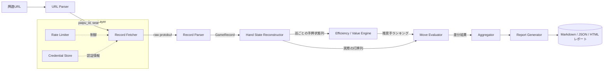
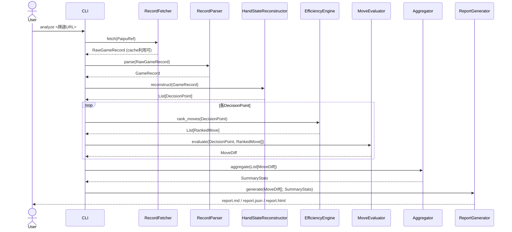

# 雀魂牌譜解析ツール 設計書

- ステータス: Draft v0.1（初版）
- 関連: [`../CLAUDE.md`](../CLAUDE.md)（本プロジェクトが遵守する雀魂利用規約・開発ルール）

---

## 1. 目的・概要

雀魂（じゃんたま）の**牌譜URL**を入力とし、対局終了後の牌譜データを取得・解析することで、

1. 各打牌・鳴き判断のタイミングにおける「最適手（効率・期待値の観点での推奨アクション）」を算出し、
2. 実際にプレイヤーが選択した打牌・鳴き・リーチ等と比較し、
3. 一致率や損失（シャンテン数・期待値・打点などの観点）を統計化してレポートする

ツールを構築する。**対局後の振り返り・上達支援を目的としたオフライン解析ツール**であり、
対局中にリアルタイムで指し手を提示する機能は持たない（[CLAUDE.md](../CLAUDE.md) 参照）。

### 1.1 スコープ

**対象とする（In Scope）**

- 雀魂の牌譜URLからの対局ID・観戦対象プレイヤーの特定
- 牌譜データ（打牌・鳴き・リーチ・和了・流局等のイベント列）の取得とパース
- 各局・各巡における「最適手」の算出（打牌効率・期待値ベース）
- 実際の打牌・判断との差分検出とラベリング
- 対局単位・セッション単位の統計集計とレポート出力（Markdown / JSON / 簡易HTML）
- CLIからの実行

**対象外（Out of Scope / 非対応）**

- 対局中のリアルタイム指し手提示・自動打牌（botプレイ）
- 他ユーザーの牌譜の同意なき大量収集・ランキングサイト化
- 雀魂クライアントの改変・チート・逆アセンブル
- 牌画像・キャラクター等、雀魂の著作物そのものの再配布
- 天鳳など他家サービスの牌譜フォーマットへの対応（将来検討）

---

## 2. 全体アーキテクチャ



処理は大きく **(1) 取得層 → (2) 復元・解析層 → (3) 評価層 → (4) レポート層** の4段に分かれる。
取得層は [CLAUDE.md](../CLAUDE.md) の遵守ルール（自アカウントのみ・レート制限・非改変クライアント準拠）
を実装する **Compliance Layer** に包まれる。

---

## 3. モジュール設計

### 3.1 `url_parser`（URL解析）

- 入力例: `https://game.mahjongsoul.com/?paipu=YYMMDD-xxxxxxxx-xxxx-xxxx-xxxx-xxxxxxxxxxxx_a<seat>`
  のような、雀魂の対局結果画面「牌譜を見る」から得られる共有URL。
- 責務:
  - クエリパラメータ `paipu` から **対局ID（UUID相当）** を抽出。
  - `_a<N>` サフィックスなどから**閲覧対象の席（観戦視点）**を抽出（無指定時は全員分を解析対象にできるようにする）。
  - フォーマット不正時は明示的なエラー（`InvalidPaipuUrlError`）を返す。

```python
@dataclass(frozen=True)
class PaipuRef:
    game_uuid: str
    focus_seat: int | None  # None の場合は指定なし（全員分を解析）
```

### 3.2 `record_fetcher`（牌譜取得・Compliance Layer）

- 責務: 対局IDをもとに、雀魂サーバーから牌譜本体（打牌・鳴き等のアクション列を含む protobuf メッセージ）を取得する。
- 前提:
  - 認証は**利用者本人のアカウント**でのみ行う。認証情報はローカル設定ファイル（環境変数 or 暗号化された
    ローカルファイル）から読み込み、リポジトリやログに出力しない。
  - 通信プロトコルは、コミュニティで広く公開されている **liqi.proto 相当のメッセージ定義**
    （打牌・鳴き・和了などのアクション種別と対局結果の構造）を用いる。雀魂クライアント本体の改変・逆解析は行わず、
    非改変クライアントと同一の通信仕様に**外部から準拠**する形で実装する。
  - `RateLimiter` を介して、同一アカウントからの短時間大量アクセスを防止する
    （例: 直近1分あたりの取得件数に上限、リトライは指数バックオフ）。
  - ネットワークエラー・認証失敗・該当牌譜なし、をそれぞれ区別した例外を送出する。
- キャッシュ: 一度取得した牌譜は `cache/` 配下にローカル保存し、再解析時に再取得しないようにする
  （サーバー負荷軽減 / [CLAUDE.md](../CLAUDE.md) 遵守）。

```python
class RecordFetcher(Protocol):
    def fetch(self, ref: PaipuRef) -> RawGameRecord: ...
```

### 3.3 `record_parser`（牌譜パース）

- 責務: 取得した raw protobuf データを、解析しやすい内部データモデル `GameRecord` にデコードする。
- 対応イベント種別（最低限）:
  - `Deal`（配牌）
  - `Draw`（自摸）
  - `Discard`（打牌／リーチ宣言フラグ／ツモ切りフラグを含む）
  - `Call`（チー／ポン／カン、鳴かれた牌と構成牌）
  - `Riichi`（リーチ宣言）
  - `Hora`（和了：役・翻数・符・点数・裏ドラ等）
  - `Ryuukyoku`（流局：形式テンパイ状況等）
  - 局区切り（東1局0本場 等）・ドラ表示牌・持ち点変動

### 3.4 `hand_state`（手牌状態復元）

- 責務: イベント列を先頭から再生し、**各時点での各プレイヤーの手牌（濃色/副露）・捨て牌・ドラ・残り牌山**
  を逐次再構築する。これにより「その打牌選択の直前時点で、そのプレイヤーが選べた選択肢は何だったか」を
  復元できるようにする。
- 出力: `List[DecisionPoint]`

```python
@dataclass
class DecisionPoint:
    round_id: str          # 例: "East-1-0"
    turn: int
    seat: int
    hand: list[Tile]        # 打牌選択直前の手牌（自摸後14枚 or 鳴き後）
    melds: list[Meld]
    discards_by_seat: dict[int, list[Tile]]
    dora_indicators: list[Tile]
    remaining_tiles: int
    riichi_seats: set[int]
    action_type: Literal["discard", "call_decision"]
    actual_action: Action    # 実際に選ばれた打牌／鳴き／スルー
```

### 3.5 `efficiency_engine`（最適手候補の算出）

MVP（v1）では**牌効率＋簡易期待値**による決定論的エンジンとする（機械学習モデルは将来拡張、§8参照）。

- **シャンテン数計算**: 通常形・七対子・国士無双の3形についてシャンテン数を計算する
  （既知のアルゴリズム／OSSライブラリの活用を検討。ライセンス条件を確認の上採用）。
- **受け入れ枚数（ukeire）計算**: 各打牌候補について、打牌後のシャンテンを進める有効牌の種類・残り枚数を算出する。
- **危険牌評価（簡易版）**: 他家のリーチ・副露状況から、現物・スジ・壁などのヒューリスティックで
  各牌の**放銃リスクスコア**を算出する。
- **打点期待値の概算**: 現在確定している役（リーチ／タンヤオ／ドラ数等）から、和了時の期待打点を概算する。
- **総合スコアリング**: 上記を以下のような優先順位でランキングする（MVPの単純な方針）。
  1. 和了に向かわない「絶対に選ばれない」手を除外（喰い替え不可・安全性を著しく損なう等）
  2. シャンテンを進める打牌を優先
  3. 同シャンテンなら受け入れ枚数が広い方を優先
  4. 受け入れが同等なら期待打点が高い方を優先
  5. 相手がリーチ/テンパイ濃厚な局面では、危険牌評価を加味して安全側の手を上位に補正
- 出力: `List[RankedMove]`（候補手とそのスコア内訳）

```python
@dataclass
class RankedMove:
    action: Action           # 打牌 or 鳴き/スルー
    shanten_after: int
    ukeire_count: int
    ukeire_tiles: list[Tile]
    est_value: float          # 期待打点の概算
    danger_score: float       # 放銃リスクの概算（0〜1）
    total_score: float
```

### 3.6 `move_evaluator`（差分評価）

- 責務: `DecisionPoint.actual_action` が `RankedMove` ランキングの何位に相当するかを判定し、
  差分をラベリングする。
- ラベル例:
  - `OPTIMAL`: 最上位候補と一致
  - `ACCEPTABLE`: 上位N（設定可、既定3）以内で、シャンテン数・受け入れの差が閾値以下
  - `SUBOPTIMAL`: 上記に該当しないが和了に向かう手ではある
  - `MISTAKE`: シャンテンを後退させる、明確な危険牌を切る等、大きな損失を伴う選択
- 各差分に対し、`shanten差`・`ukeire差`・`est_value差` を数値で保持し、後段の集計に用いる。

```python
@dataclass
class MoveDiff:
    decision: DecisionPoint
    best_move: RankedMove
    actual_rank: int | None   # 候補内での順位（見つからない場合 None）
    label: Literal["OPTIMAL", "ACCEPTABLE", "SUBOPTIMAL", "MISTAKE"]
    shanten_delta: int
    ukeire_delta: int
    value_delta: float
```

### 3.7 `aggregator`（統計集計）

- 対局単位・プレイヤー単位で以下を集計する:
  - 最適手一致率（`OPTIMAL` の割合）
  - ラベル別件数・割合（`ACCEPTABLE`/`SUBOPTIMAL`/`MISTAKE` の内訳）
  - 平均シャンテン損失・平均期待値損失
  - 和了率・放銃率・副露率・平均和了打点・立直率などの基本指標（実績値、AIとの比較対象として）
  - 「MISTAKE」に該当した局面のハイライト（局・巡・状況のサマリ）一覧

### 3.8 `report_generator`（レポート出力）

- 出力フォーマット:
  - `report.json`: 機械可読な全データ（`MoveDiff` 一覧＋集計結果）
  - `report.md`: 人間向けサマリ（一致率、ミス局面の一覧と簡単な解説文）
  - `report.html`（任意）: 牌姿を簡易テキスト/絵文字表記で可視化した簡易ビューア
    （雀魂の著作物である牌画像は使用せず、自前のシンプルな表記に限定。[CLAUDE.md](../CLAUDE.md) 参照）

### 3.9 `cli`（エントリポイント）

```
mjsoul-analyzer analyze <牌譜URL> \
    [--seat N] \
    [--config path/to/config.yaml] \
    [--out ./reports/] \
    [--format md,json,html] \
    [--acceptable-threshold N]
```

- 初回実行時、[CLAUDE.md](../CLAUDE.md) の利用規約遵守事項への同意を対話的に確認する
  （`--yes` で非対話スキップ可能。ただし既定は同意プロンプト表示）。

---

## 4. データモデル（共通）

```python
class Suit(Enum):
    MAN = "m"; PIN = "p"; SOU = "s"; HONOR = "z"

@dataclass(frozen=True)
class Tile:
    suit: Suit
    rank: int          # 1-9 (HONORは1-7: 東南西北白發中)
    is_red_dora: bool = False

@dataclass
class Meld:
    kind: Literal["chi", "pon", "kan_open", "kan_closed", "kan_added"]
    tiles: list[Tile]
    called_from_seat: int | None

@dataclass
class Action:
    seat: int
    kind: Literal["discard", "chi", "pon", "kan", "riichi", "hora", "pass"]
    tile: Tile | None
    meld: Meld | None
    is_tsumogiri: bool = False

@dataclass
class GameRecord:
    game_uuid: str
    players: list[PlayerInfo]     # 席順・アカウント表示名(取得可能な範囲)・段位
    rounds: list[RoundRecord]

@dataclass
class RoundRecord:
    round_name: str       # "East-1-0" など
    dora_indicators: list[Tile]
    events: list[Action]
    result: RoundResult    # 和了 or 流局の結果
```

---

## 5. 処理シーケンス



---

## 6. 技術スタック（案）

| 項目 | 選定 | 理由 |
|---|---|---|
| 言語 | Python 3.11+ | 数値計算・麻雀効率計算のエコシステムが豊富、protobuf/websocketsライブラリも成熟 |
| 通信 | `websockets` + `protobuf` | 雀魂の対局データ取得プロトコルに対応するため |
| データモデル | `dataclasses` / `pydantic` | 内部データの型安全性 |
| CLI | `click` or `typer` | 使いやすいCLI構築 |
| テスト | `pytest` | 単体テスト（特に shanten/ukeire 計算の正しさの検証） |
| レポート | Jinja2 (Markdown/HTMLテンプレート) | レポート生成の柔軟性 |
| 設定/認証情報 | ローカル `config.yaml` + 環境変数（`.gitignore` 対象） | 秘匿情報をリポジトリに含めない |

---

## 7. ディレクトリ構成（案）

```
mjsoul-analyzer/
├── CLAUDE.md
├── README.md
├── docs/
│   └── DESIGN.md
├── src/
│   └── mjsoul_analyzer/
│       ├── url_parser.py
│       ├── compliance/
│       │   ├── rate_limiter.py
│       │   └── credential_store.py
│       ├── fetcher/
│       │   ├── record_fetcher.py
│       │   └── proto/            # 通信メッセージ定義（コミュニティ公開仕様に準拠）
│       ├── parser/
│       │   └── record_parser.py
│       ├── engine/
│       │   ├── hand_state.py
│       │   ├── shanten.py
│       │   ├── efficiency_engine.py
│       │   └── move_evaluator.py
│       ├── aggregator.py
│       ├── report/
│       │   ├── report_generator.py
│       │   └── templates/
│       └── cli.py
├── tests/
│   ├── engine/
│   ├── parser/
│   └── fixtures/                 # 匿名化・許諾済みのサンプル牌譜のみ格納
├── cache/                        # 取得済み牌譜キャッシュ（.gitignore対象）
└── pyproject.toml
```

---

## 8. 開発フェーズ

| フェーズ | 内容 |
|---|---|
| **v0: 準備** | 通信仕様の調査（公開情報の範囲で）、開発規約（本ドキュメント・CLAUDE.md）の確定 |
| **v1: MVP** | URL解析／牌譜取得（自アカウント限定）／パース／手牌復元／シャンテン・受け入れベースの最適手判定／実打牌との一致率レポート（Markdown） |
| **v2: 精度向上** | 危険牌評価の精緻化、期待値計算の高度化（役の複合、赤ドラ・裏ドラ期待値等）、JSON/HTML出力対応 |
| **v3: 拡張（任意）** | 既存の高精度AI（例: 強い牌譜検討AI）を「最適手プロバイダ」として差し替え可能なプラグイン構造にする。
外部AIを利用する場合も、当該AIのライセンス条件と [CLAUDE.md](../CLAUDE.md) の遵守事項を満たすことを条件とする |
| **v4: UI** | Webベースの簡易ビューア（牌譜再生＋差分ハイライト表示） |

`efficiency_engine` はインターフェース (`MoveRankingProvider`) として抽象化し、
v1の自前ロジックとv3以降の外部AIベースの実装を差し替え可能にする。

```python
class MoveRankingProvider(Protocol):
    def rank_moves(self, decision: DecisionPoint) -> list[RankedMove]: ...
```

---

## 9. 利用規約遵守に関する設計上の考慮（まとめ）

本設計は [CLAUDE.md](../CLAUDE.md) の遵守事項に基づき、以下を設計原則としている。

- 取得層（`record_fetcher`）は Compliance Layer に包み、**自アカウント認証・レート制限・キャッシュ**を必須とする。
- 解析対象は**終了済みの牌譜のみ**（`efficiency_engine` の出力は事後レポートにのみ使用し、
  対局中に送信するAPIやUIは設計に含めない）。
- 雀魂の著作物（画像・音声等）はリポジトリ・レポートに含めず、牌の表記はテキスト/自前アイコンに限定する。
- 認証情報は `compliance/credential_store.py` に集約し、平文でのログ出力・コミットを禁止する
  （コードレビュー時のチェック項目とする）。

## 10. 未解決の課題・リスク

- 雀魂の通信プロトコルは非公開の独自仕様であり、**運営による仕様変更で取得層が動作しなくなるリスク**がある。
  → `record_fetcher` をプロトコル定義から分離し、仕様変更時に影響範囲を局所化する。
- 利用規約の解釈にはグレーゾーンが残る（例: 「外部ツール」の定義が対局中の補助を指すのか、
  対局後の振り返りツールも含むのか、公式に明言されていない）。
  → 本ツールは**対局後の個人利用の学習ツール**であることを明確にし、疑わしい機能拡張は追加前に
  必ず人間の判断を仰ぐ（[CLAUDE.md](../CLAUDE.md) 参照）。運営から個別に見解が示された場合は、
  本ドキュメントと `CLAUDE.md` を速やかに更新する。
- 最適手判定ロジック（v1の簡易効率ベース）は、必ずしも「真の最適解」を保証しない。
  レポート上は「本ツールが算出した推奨手」であることを明記し、絶対的な正解として提示しない。
